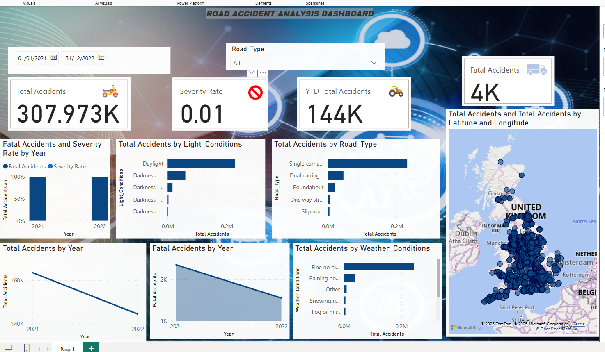

# 🛣️ Road Accident Analysis Dashboard

This repository contains an interactive Power BI dashboard and the underlying analysis of road accident data, aimed at identifying high-risk locations, common causes, and significant trends to inform safety improvement initiatives.

## 🎯 Project Objective

The primary goal of this project was to analyze historical road accident data to provide actionable insights for stakeholders (e.g., traffic authorities, urban planners) to enhance road safety and reduce accidents.

## 💡 Key Questions Addressed

* Where are the main accident hotspots?
* What are the prevailing trends in accident frequency and severity over time?
* What are the most common contributing factors to road accidents?
* How does accident severity vary across different conditions (e.g., road type, weather, time of day)?

## 📊 Deliverables

* **Interactive Power BI Dashboard:** A dynamic and user-friendly dashboard for exploring accident data.
* **Data Analysis Report:** Underlying insights derived from the dataset.

## 📈 Analysis & Insights

Through the analysis, the dashboard provides visual answers to critical questions, such as:

* **Accident Hotspots:** Identification of geographical areas with a high concentration of accidents, pinpointing critical sections of roads or intersections.
* **Temporal Trends:** Visualization of accident frequency and severity over time (yearly, monthly, daily, hourly) to reveal peak periods.
* **Contributing Factors:** Breakdown of accidents by common causes, vehicle types involved, weather conditions, road conditions, and light conditions.
* **Severity Analysis:** Understanding the distribution of fatal, severe, and slight accidents across different dimensions.

---
**[YOUR_INSIGHTS_HERE]**
*(Example: "The analysis revealed that **[Specific Location/Road Type]** accounts for **[X%]** of all severe accidents, often occurring during **[Specific Time/Day]**. **[Factor e.g., Speeding/Poor Visibility]** was identified as a major contributing factor in **[Y%]** of these incidents.")*

*(Example: "A noticeable trend of increasing **[Fatal/Severe]** accidents was observed in **[Year/Period]**, particularly on **[Road Type]** roads during **[Time of Day]**.")*

*(Example: "Vehicle type **[Car/Bike/Bus]** was involved in the highest percentage of accidents, suggesting a need for targeted safety campaigns for these vehicle categories.")*
---

## 🛠️ Tools & Technologies Used

* **Power BI:**
    * **Power Query:** For data extraction, transformation, and loading (ETL), including cleaning inconsistencies and feature engineering (e.g., extracting Year, Month, Hour).
    * **DAX (Data Analysis Expressions):** For creating calculated measures (e.g., Total Accidents, Fatal Accidents, Severity Rate) and complex aggregations.
    * **Maps Visualizations:** For geographic mapping to identify accident hotspots.
    * **Various Chart Types:** Bar charts, line charts, pie charts, and KPIs for data visualization.
* **Excel:** Potentially for initial data inspection or minor pre-processing.
* **SQL (Optional):** For data extraction or querying from a database if the data source was SQL-based.
* **Python (Optional):** For advanced statistical analysis or predictive modeling (e.g., forecasting trends or severity prediction - *Note: If you used Python for this, briefly describe what you did*).

## 📁 Project Structure

* `Road Accident Data.csv`: The raw dataset used for this analysis.
* `[YOUR_PBIX_FILE_NAME.pbix]`: The Power BI Desktop file containing the data model, transformations, measures, and the interactive dashboard.
* `Assets/`: (Optional, but recommended) Folder containing design assets like background images, vehicle icons (`Bike 3.png`, `Bus.png`, `Car.png`, `Other.png`, `tractro 2.png`, `Van.png`), and the `Road Accident Dashboard Reference.jpg`.
* `README.md`: This file.

## 🚀 How to View the Dashboard

1.  **Clone the repository:**
    ```bash
    git clone [https://github.com/your-username/your-repository-name.git](https://github.com/your-username/your-repository-name.git)
    ```
    (Replace `your-username` and `your-repository-name` with your actual GitHub details.)
2.  **Open in Power BI Desktop:** Download and install [Power BI Desktop](https://powerbi.microsoft.com/desktop/).
3.  **Navigate to the cloned folder** and open the `[YOUR_PBIX_FILE_NAME.pbix]` file.

The dashboard will load, and you can interact with the slicers and visuals to explore the accident data.

## 📸 Dashboard Preview

*(**Highly Recommended:** After saving this README, take a screenshot of your Power BI dashboard and add it to your GitHub repository. You can then link it here.)*

```markdown

